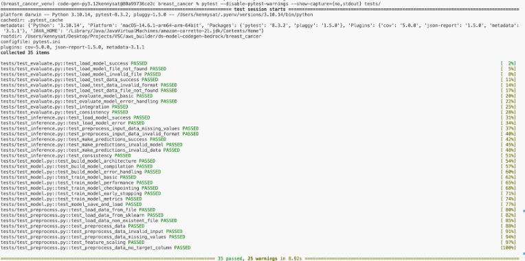

# Code Generation Using Amazon Bedrock

An advanced code generation module for local or remote systems leveraging Generative AI.


## Overview
The Code Generation Module is designed to be used as a showcase for leveraging Generative AI models in the context of code generation and development workflows. It demonstrates how AI models can be integrated into the development process to streamline code generation, testing, and error handling, ultimately improving Data Scientist productivity and efficiency.

### Key Features

1. **Configuration Management**: The module allows users to define project-specific configurations, including environment settings, model settings, prompt templates, and test runner settings, through YAML files.

2. **Virtual Environment Setup**: The module automates the setup of a virtual environment for the project, ensuring consistent dependency management and isolation.

3. **Code Generation**: Users can generate baseline code for their project using prompts and templates tailored to their specific requirements.

4. **Test Case Generation**: In addition to source code, the module can generate test cases (pytest files) based on the generated source code.

5. **Test Execution and Error Handling**: The module supports running tests on the generated code and test cases, and provides mechanisms for iteratively fixing errors and issues through prompts and interactions with the Large Language Model using Amazon Bedrock.

6. **Modular Design**: The codebase is structured in a modular fashion, with separate components for code generation, file management, test execution, and configuration management, allowing for easy extensibility and customization.

### Contents
- [Overview](#overview)
- [Architecture](#architecture)
- [Prerequisite](#prerequisite)
- [Setting up](#setting-up)
- [Repo Structure](repo-structure)

## Architecture

The technical architecture diagram below illustrates the interaction between the code generation module, the AWS SDK for Python (Boto3), and the Amazon Bedrock service.


## Prerequisite

### Amazon Bedrock Model Access

Make sure you have access to the required foundation models in Amazon Bedrock. To check your model access and request access if needed:

1.	Navigate to the Amazon Bedrock console.
2.	In the left navigation pane, choose Model access.
3.	Verify that you have access to the necessary models (e.g., Anthropic's Claude models).
4.	If you don't have access, follow the instructions at [Amazon Bedrock User Guide](https://docs.aws.amazon.com/bedrock/latest/userguide/model-access-modify.html) to request model access.

### System Requirements
- This module has been thoroughly tested on macOS. Unix-based operating systems should be able to follow along with minor adjustments as needed.
- Windows users may encounter issues setting up the virtual environment. While the code includes Windows support, it has not been extensively tested on this platform.

### Required Software
1. [pyenv](https://github.com/pyenv/pyenv) - For managing multiple Python versions for the Code Generation Module
2. [Poetry](https://python-poetry.org/) - For dependency management and packaging
3. [Local AWS Configuration](https://docs.aws.amazon.com/cli/v1/userguide/cli-configure-files.html)
4. [AWS CLI Installation](https://docs.aws.amazon.com/cli/latest/userguide/getting-started-install.html)

## Setting up

### Installing and Configuring pyenv

pyenv is used to manage multiple Python versions on the system. In this blog, it’s assumed that you have the required python version installed for the code generation module. If you already have pyenv installed, you can skip to step 4.

1. Install pyenv by following the instruction for [macOS](https://github.com/pyenv/pyenv?tab=readme-ov-file#homebrew-in-macos) or [Windows](https://github.com/pyenv/pyenv?tab=readme-ov-file#windows). The following code shows how to install using Homebew in macOS:

   ```bash
   brew install pyenv
   ```

2. Add pyenv initialization to your shell configuration. For zsh users, edit your `~/.zshrc` file:
   ```bash
   echo 'export PYENV_ROOT="$HOME/.pyenv"' >> ~/.zshrc
   echo 'command -v pyenv >/dev/null || export PATH="$PYENV_ROOT/bin:$PATH"' >> ~/.zshrc
   echo 'eval "$(pyenv init -)"' >> ~/.zshrc
   ```

3. Restart your shell or reload the configuration:
   ```bash
   source ~/.zshrc
   ```

4. Install the required Python version for the project:
   ```bash
   pyenv install 3.12.4
   pyenv install 3.10.14
   ```

### Installing Poetry

Poetry is used for dependency management.

1. Skip this step if Pipx (recommended way to install Poetry) is already installed in your environment.<br /> Run the following command in the terminal to install Pipx: [[1]](https://pipx.pypa.io/stable/installation/)

   ```bash
   brew install pipx
   pipx ensurepath
   sudo pipx ensurepath --global # optional to allow pipx actions in global scope. See "Global installation" section below.
   ```
   NOTE: If the `pipx ensurepath` command returns the warning `Warning: Found a space in the pipx home path`, refer to the "How to Fix" section in the Pipx Documentation [here](https://pipx.pypa.io/stable/troubleshooting/#pipx-files-not-in-expected-locations-according-to-documentation). This warning occurs when your user directory path contains spaces, which can cause issues with some tools. The documentation provides steps to resolve this issue.

2. Skip this step if Poetry is already installed in your environment.<br /> Run the following command in the terminal to install Poetry: [[2]](https://pipx.pypa.io/stable/installation/)

   ```bash
   pipx install poetry
   ```

### Project Setup
1. Clone the repository and navigate to the project directory:
   ```bash
   git clone https://github.com/aws-samples/bedrock-code-gen.git
   cd bedrock-code-gen
   ```

2. Run the following command to ensure you are using the right python version or you may run into dependency conflicts.
   ```bash
   poetry env use 3.12.4
   ```
3. Setup and activate virtual environment to run the project code:
     ```bash
     poetry install
     poetry shell
     ```
4. Run the following command to set up the virtual environment as a kernel in jupyter notebook (`.ipynb` file) execution environment. This will allow the jupyter notebook execution environment to recognize and use the virtual environment you created:
   ```
   python -m ipykernel install --user --name=code-gen-py3.12

   ``` 
5. Restart your IDE (e.g., Visual Studio Code) to make sure it recognizes the newly installed kernel.

This setup allows you to easily switch between Python versions for testing or development purposes, while maintaining consistent dependency management with Poetry.

## Usage
### Sample Configuration and Template
Open `params/breast_cancer.yml` file and update the region parameter to match your AWS account region. That is the only adjustment you need to make in order to follow the subsequent instructions. If you wish, you can also experiment with different model_id values from Anthropic (other models may require update of the `inference_modifier` as well as minor adjustments in Boto3 API call to Amazon Bedrock in code_gen/code_generator.py) to see what configuration may yield the best results. 

#### Execute LangGraph
LangGraph is a library that extends LangChain, allowing developers to create complex, stateful workflows with multiple AI agents for building advanced language model applications. The following steps provide an instruction to run Code Module for Breast Cancer Classification project with a sample template breast_cancer_config.yml. If you prefer to examine a sample output of Module first, you can skip execution of LangGraph by looking in the file directory breast_cancer generated by the Module.

1. Locate and open langgraph.ipynb notebook in your jupyter notebook (`.ipynb` file) execution environment
2.	Select code-gen-py3.12 as a notebook kernel. This kernek should have been created during setup. 
3.	Execute the comprehensive code generation and testing pipeline.
#### Generated Codebase
The module has generated and iteratively refined the entire codebase for the Breast Cancer Project as specified by the prompt templates. An image below is an output cell of executed code in the notebook. As you can see, the code generation and test were iterated 4 times until all tests passed. 

Key features include:
- Automatic code generation and text iteration capabilities, potentially continuing indefinitely 
- Implementation of best practice guardrails within the prompts 
- Detailed instructions to guide the AI model

A sample output without the virtual environment (breast_cancer_venv) can be found in the project directory. To recreate the project environment using the sample, Follow the instructions for [Install packages in a virtual environment using pip and venv](https://packaging.python.org/en/latest/guides/installing-using-pip-and-virtual-environments/), and use the `breast_cancer/requirements.txt` file, which contains all project dependencies. 

#### Test and Coverage Result
You can check the test results using two methods: 

1.	Retrieve Test Results from the State

   Execute the following code in your notebook:

   ```python
   from code_gen.utils import PrintTestResultSummary

   print_summary = PrintTestResultSummary(final_state)
   print_summary.generate_result_summary()
   ```

2.	Run Pytest from Terminal

   Navigate to your project directory and activate the virtual environment:

   ```bash
   cd path/to/project/bedrock-code-gen/breast_cancer/

   source /path/to/project/bedrock-code-gen/breast_cancer/breast_cancer_venv/bin/activate
   ```
   Then run pytest:
   ```bash   
   pytest --disable-pytest-warnings --show-capture={no,stdout} tests/
   ```
Our recent test run resulted in all 35 test cases passing successfully. The coverage report shows a total test coverage of 96%. Images are shown in below for the results.




### How to Extend to Other Use Cases
To adapt the code generation for different projects (e.g., Regression with Abalone Dataset), follow these steps:

1.	Create a New Project-Specific Prompt File
- Duplicate code_gen/prompts/breast_cancer_config.yml
- Rename it to match your new project (e.g., abalone.yml)

2.	Update the New Prompt File
- Modify the following key elements:
- project_name
- dataset_names
- File-specific instructions in modules and tests sections

Example: Adapting for Abalone Project

   ```bash  
   project_name: "Regression with Abalone Dataset" 
   dataset_names: "Abalone Dataset"

   modules:
   preprocess_abalone:
      filename: src/preprocess_abalone.py
      description: "This module contains functions to preprocess the abalone dataset, including data cleaning and feature scaling."
      steps: |
         1. Load the abalone dataset
         2. Handle missing values if any
         3. Encode categorical features
         4. Scale numerical features
         5. Split data into features and target variable

   tests:
   preprocess:
      filename: tests/test_preprocess_abalone.py
      module_name: src.preprocess_abalone
      function_names: "load_data, preprocess_data"
      test_scenarios: |
         1. Test data loading function
         2. Verify preprocessing steps
         3. Check for correct data splitting
         4. Ensure proper scaling of features
   ```
Important: After adding or removing files, ensure you reflect these changes in the module and test files by passing the correct baseline_file_names and baseline_test_file_names to SharedState in LangGraph. For example:

   ```python
   # Specify code base for project. 
   # Ensure corresponding prompt templates are provided.
   baseline_file_names = {
      "preprocess_abalone": "preprocess_abalone.py",
      "requirements": "requirements.txt"    
   }

   # Dynamically create test code model based on code base
   baseline_test_file_names = {f"{k}": f"{k}" for k, v in baseline_file_names.items() if k not in ['requirements', 'main']}


   # initialze state
   initial_state = SharedState(
      config_path=PromptHandler.resolve_file_path(',', 'params/breast_cancer.yml'),
      baseline_file_names=baseline_file_names,
      baseline_test_file_names=baseline_test_file_names,
      max_iterations=max_iterations
   )
  ```
3.	Create and Update Parameter File 
- Duplicate params/breast_cancer.yml
- Rename it to match your project (e.g., abalone.yml)
- Update the following settings. Below is an example. 
   ```bash
   # Default settings that can be reused across different sections
   defaults: &defaults
   region: us-west-2
   # Specify your preferred AWS region where Bedrock is available

   # Environment settings
   env_settings:
   project_name: &project_name abalone_regressor
   # Specify your project name. This will be used as a reference for other settings.
   venv_name: *project_name
   # Virtual environment name. '_venv' will be automatically appended by ConfigManager.
   python_version: '3.12.4'
   # Specify the Python version for your project. Ensure this version is installed on your system.

   # Prompt settings for AI model interactions
   prompt_settings:
   config_file_path: './code_gen/prompts/abalone.yml'
   # Path to the project-specific prompt configuration
   # You can provide your own project-specific prompt file, e.g., './code_gen/prompts/your_prompt.yml'
   ```
#### Concrete Example: Regression with Abalone Dataset

For a more tangible example of extending to another use case, you can examine the Regression with Abalone Project. This project successfully generated code with all tests passing. You can find the following key files:

1.	Configuration file: `params/abalone.yml`
2.	Prompt file: `code_gen/prompts/abalone.yml`

These files demonstrate how to adapt the system for a regression task using the Abalone dataset. They showcase the necessary modifications in both the configuration and prompt structures to accommodate a different type of machine learning problem and dataset.
All generated files for this project are stored in the abalone directory. Exploring the directory will give you a clear picture of how the code generation system adapts to a new use case, from initial configuration to final output. It serves as a practical reference for when you're extending the system to your own projects.

## Repo Structure
* [code_gen](code_gen)
     * [ai_message_parser.py](code_gen/ai_message_parser.py) Custom structured output (as the feature was not supported in ChatBedrock on Aug 2024)
     * [code_generator.py](code_gen/code_generator.py) Generate code using a language model and managing the state of the code generation process
     * [code_models.py](code_gen/code_models.py) Defines a Pydantic model to represent code files and functions to create a dynamic code base using the files
 model instance.
     * [config_manager.py](code_gen/config_manager.py) Defines how to load and manage various configuration settings for an application from a YAML file or environment variables, including settings for a model, prompts, context, test runner, and directed acyclic graph (DAG).
     * [bedrock.yml](code_gen/bedrock.yml) Maps various model providers and their corresponding model IDs or ARNs (Amazon Resource Names) for use with Amazon Bedrock.
     * [file_manager.py](code_gen/file_manager.py) Generate source and test files from FileState objects and store file in the disk.
     * [graph_state.py](code_gen/graph_state.py) Represents the state of a file during the code generation and testing process. It keeps track of various attributes such as the filename, file type, code, messages, the current status of the file, and error (if any), and other.
     * [logger.py](code_gen/logger.py) Provides logging functionality
     * [model_manager.py](code_gen/model_manager.py) Contains static methods to check the availability and access of foundation models in Amazon Bedrock
     * [prompts](code_gen/prompts)
          * [breast_cancer_config.yml](code_gen/breast_cancer_config.yml) A sample project configuration that provide project specific data to the prompt_templates.yml
          * [prompt_templates.yml](code_gen/prompt_templates.yml) Reusable prompt templates used for code generation, testing, and fixing the code
     * [test_runner.py](code_gen/test_runner.py) Run tests on source and test files, manage their states, and handle test failures by generating prompts to fix import and code issues
     * [utils.py](code_gen/utils.py) Provide utility tools to print results and status of code generation and tests, with other utilities to handle files, prompts, and more
     * [virtual_env_manager.py](code_gen/virtual_env_manager.py) Manage the project's virtual environment and creating the necessary configuration files for running tests
* [langgraph.ipynb](code_gen/langgraph.ipynb) The entry point for a code generation and testing pipeline. It orchestrate the entire process of generating a codebase, setting up the development environment, creating test cases, running tests on the generated code and test cases, and iteratively fixing any issues until all tests pass or a maximum number of iterations is reached.
* [params](code_gen/params)
     * [breast_cancer.yml](code_gen/breast_cancer.yml) A YAML configuration file that defines various settings and parameters for a sample project, breast cancer classification, including environment settings, workflow settings, model settings, prompt settings, test runner settings, and context settings
* [pyproject.toml](code_gen/pyproject.toml) A configuration file used by the Poetry package manager for Python projects. It defines the project's metadata, dependencies, development dependencies, build system requirements, and other settings related to the project's structure and management.

## Additional Notes
- While the code includes provisions for Windows compatibility, it has not been extensively tested on Windows. Users may encounter issues, particularly with virtual environment setup.
- For any OS-specific issues, please refer to the respective documentation for pyenv and Poetry installations.

**Reference**

[1] Installation | Documentation | Pipx <br />
[2] Introduction | Documentation | Poetry <br />
[3] Code generation with RAG and self-correction | Blog | LangGraph

